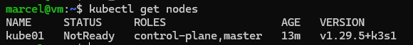
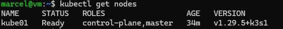
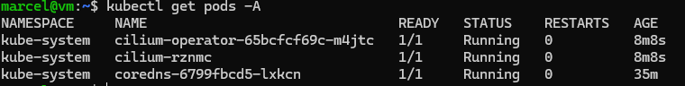
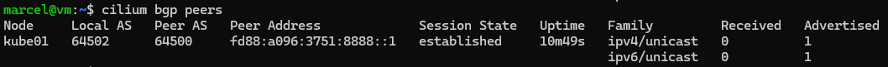

# my home k3s cluster

## cluster deployment
### k3s install

download and install k3s:
```
curl -sfL https://get.k3s.io | sh -s - server --write-kubeconfig-mode 644 --cluster-cidr=fd42::/48 --service-cidr=fd43::/112 --disable=servicelb,traefik,local-storage,metrics-server --flannel-backend=none --disable-network-policy --node-ip={nodeIP}
```
extract kubeconfig with `cat /etc/rancher/k3s/k3s.yaml` and copy it to local path `.kube/config` on your admin machine. Replace the local ip adress with the actual ip of the node. You should be able to connect to the freshly installed k3s instance and list your first node with `kubectl get nodes`.
The output should look something like this:



### cilium deployment
install cilium cli to your admin machine ([cilium.io](https://docs.cilium.io/en/stable/gettingstarted/k8s-install-default/#install-the-cilium-cli)):
```bash
CILIUM_CLI_VERSION=$(curl -s https://raw.githubusercontent.com/cilium/cilium-cli/main/stable.txt)
CLI_ARCH=amd64
if [ "$(uname -m)" = "aarch64" ]; then CLI_ARCH=arm64; fi
curl -L --fail --remote-name-all https://github.com/cilium/cilium-cli/releases/download/${CILIUM_CLI_VERSION}/cilium-linux-${CLI_ARCH}.tar.gz{,.sha256sum}
sha256sum --check cilium-linux-${CLI_ARCH}.tar.gz.sha256sum
sudo tar xzvfC cilium-linux-${CLI_ARCH}.tar.gz /usr/local/bin
rm cilium-linux-${CLI_ARCH}.tar.gz{,.sha256sum}
```
As we are using IPv6 and BGP, install cilium with the following options:

`
cilium install --set ipv6.enabled=true,bgpControlPlane.enabled=true
`

After that you can wait until the deployment is done with `cilium status --wait`. After the deployment finishes, your node should be ready `kubectl get nodes`:


You can also take a look at all the deployed pods `kubectl get pods -A`:


You can check your cilium deployment and node connectivity with `cilium connectivity test`. This should result in: \
`✅ [cilium-test] All 45 tests (290 actions) successful, 35 tests skipped, 1 scenarios skipped.`

Now the k3s cluster with cilium cli is sucessfully deployed. Now would be a great time to create a vm snapshot. If something goes wrong, you always come back to this point in time.

## Argo CD
[Argo CD](https://argo-cd.readthedocs.io/en/stable/) is a declarative, GitOps continuous delivery tool for Kubernetes. We are going to deploy everything declarative through argocd. 

install [argocd cli](https://argo-cd.readthedocs.io/en/stable/cli_installation/#download-with-curl):
```
curl -sSL -o argocd-linux-amd64 https://github.com/argoproj/argo-cd/releases/latest/download/argocd-linux-amd64
sudo install -m 555 argocd-linux-amd64 /usr/local/bin/argocd
rm argocd-linux-amd64
```

We are starting with a [default deployment](https://argo-cd.readthedocs.io/en/stable/getting_started/#1-install-argo-cd) to get started: 
```
kubectl create namespace argocd
kubectl apply -n argocd -f https://raw.githubusercontent.com/argoproj/argo-cd/stable/manifests/install.yaml
```

We can not yet expose argocd with an `LoadBalancer`, because our cilium installation cannot route any bgp traffic nor hand out any ips. So just for the initial setup we making use of the port forwarding included in `kubectl`: `kubectl port-forward svc/argocd-server -n argocd 8080:443`. \
We can retrieve the default admin credentials via `argocd admin initial-password -n argocd`, or just by reading the secret named `argocd-initial-admin-secret`: \
`kubectl get secret -n argocd argocd-initial-admin-secret --template={{.data.password}} | base64 -d`

You can login through the webinterface (https://localhost:8080/) or through the cli as described [here](https://argo-cd.readthedocs.io/en/stable/getting_started/#4-login-using-the-cli). First of we are gonna change the initial admin password and afterwards delete the secret containing it: `kubectl delete secret -n argocd argocd-initial-admin-secret`

### First argocd application
Let´s get started with our first deployment. We will start with an easy deployment that does not any customization. Our first deployment will be [sealed-secrets](https://github.com/bitnami-labs/sealed-secrets). We really don´t need the deployment at this point in time yet, but it is very simple to deploy.
Use the webinterface to create an application, give it a name, put it in the default project for now, enter the url https://bitnami-labs.github.io/sealed-secrets as an helm chart, pick the correct chart and the latest version, choose in-cluster as your destination cluster name and `kube-system` as your namespace, you do not need to edit any helm parameters. 

After the application is created, you need to sync the application, to apply the displayed resources. You can go with the default options for now. You can watch the resources being deployed and getting ready (green).

For me everything gets deployed successfully, but the sync status is still `OutOfSync`. This is due to the autmatically created `CiliumIdentity` by our cni cilium. You can delete resource, but it will be recreated instantly. To display our application sync status as `Synced`, we are going to ignore the `CiliumIdentity` CRD completly in argocd. \
We need to patch the argocd config map `kubectl edit cm argocd-cm -n argocd` and add the following section to the config map: 
```yaml
data:
  resource.exclusions: |
    - apiGroups:
      - cilium.io
      kinds:
      - CiliumIdentity
      clusters:
      - "*"
```
Attention! If you already got an data and/or resource.exclusions section, you need add the new values to the already present sections.

After patching the argocd config, your application should be `Healthy` and `Synced`:


Using the webinterface is one way of creating an application, you can also create the `Application` yaml by hand and apply it with `kubectl`. At the end both ways will result in an `Application` deployend in the argocd namespace.

We can extract the yaml definition of the already deployed `Application` by `kubectl get application -n argocd sealed-secrets -o yaml > sealed-secrets.yaml`. The newly created file sealed-secrets.yaml contains the complete state of the `Application`, but we are only interested in the declarative definition of the `Application` CRD and not in it´s current state. After we delete the `status` section from the file, we can also delete `creationTimestamp`, `generation`, `resourceVersion`, `uid` from the `metadata` section and afterwards it should look something like this:

```yaml
apiVersion: argoproj.io/v1alpha1
kind: Application
metadata:
  name: sealed-secrets
  namespace: argocd
spec:
  destination:
    name: in-cluster
    namespace: kube-system
  project: default
  source:
    chart: sealed-secrets
    repoURL: https://bitnami-labs.github.io/sealed-secrets
    targetRevision: 2.16.0
```

## Loadbalancing
We are going to make use of the cilium `LoadBalancer` with the addition of bgp-routing. The [Border Gateway Protocol](https://de.wikipedia.org/wiki/Border_Gateway_Protocol) (BGP) helps us to route a one of our ip addresses from our router to our cluster services. The real advantages come into play on a multi-node cluster. Multiple paths across the nodes are published as bgp-routes; -> more HA, more flexibility.
\
To use bgp within cilium we need to create a `CiliumBGPPeeringPolicy`. We will start with the yaml from the [documentation](https://docs.cilium.io/en/stable/network/bgp-control-plane/#ciliumbgppeeringpolicy-crd), choose an local ASN (like 64500), change the neighbor-peer data and add an `serviceSelector` that matches every service, resulting in something like [this](definitions/cilium-bgp/peeringpolicy.yaml).
\
To deploy our newly created PeeringPolicy we create an argocd application like [this](definitions/argocd-applications/cilium-bgp.yaml) and depoly it´s manifest to the cluster and sync the application.

After the successful `CiliumBGPPeeringPolicy` deplpoyment and **external bgp router configuration**, the connection can be displayed by `cilium bgp peers`:

It should show an established session state and an uptime.

We are now able to announce routes via bgp, but we currently have nothing to announce. We need a way to assign an ip address to a service. This can be done by [cilium ip address management (IPAM)](https://docs.cilium.io/en/stable/network/concepts/ipam/#ip-address-management-ipam). We just need to deploy an `CiliumLoadBalancerIPPool` to enable this feature and start handing out ip addresses to our `LoadBalancer` services. \
Add the [ipool.yaml](definitions/cilium-bgp/ippool.yaml) to the repo and resync the app.

To test both our automatic ip address assignment and the bgp announcement, we can patch our argocd service type from `ClusterIP` to `LoadBalancer` (`kubectl patch svc argocd-server -n argocd -p '{"spec": {"type": "LoadBalancer"}}'`). Following things should happen:
1. An ip address should be assigned
1. The newly assigned ip address should be announced via bgp immediately
1. The service should be reachable from outside the cluster via it´s ip address

You can check the assignment with `kubectl get svc -n argocd` and get an external ip, the advertisement with `cilium bgp routes advertised ipv6 unicast`.

---
non structures notes below
---

### Option A
First we will deploy argocd manually, afterwards we will add the argocd deployment as an application to argocd itself. This way argocd will manage itself after its initial deployment.

### Option B
Create argocd application yaml files. Deploy argocd including the application to manage itself.

## infrastructure apps
### argocd deployment
app of apps
### deploy infrastructure repository
if needed, restore backed up certificates for sealed secrets

### deploy app repository

## ArgoCD repo
1. argocd

## Infrastructure repo
1. sealed secret
1. cert-manager
1. externaldns
1. storage provisioning

## App layer 1 repo
1. authentik

## App layer 2 repo
1. immich
1. paperless
1. nextcloud